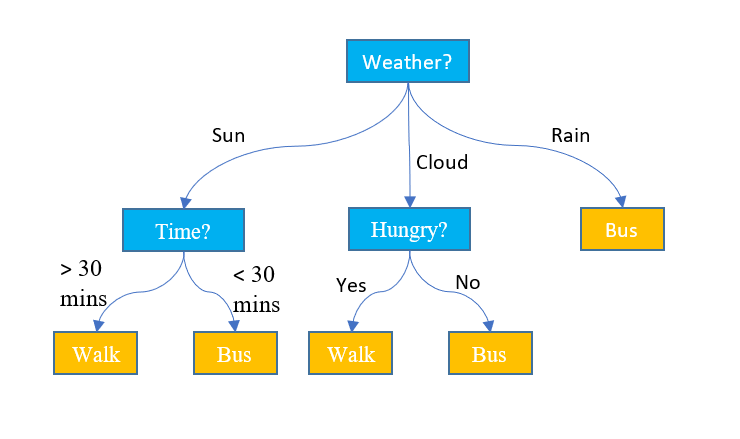

## Calculating Entropy & Information Gain for Decision Tree

Entropy is the average rate at which information is produced by a stochastic source of data, Or, it is a measure of the uncertainty associated with a random variable.

The information gain is the amount of information gained about a random variable or signal from observing another random variable.

This project includes the following 
- Reading CSV file.
- Get the main properties. 
- Get sample positives.
- Get sample negatives. 
- Get number of Features. 
- Then it will get the data and count each feature options.
- Calculates the Entropy for each Feature then for each option.
- The last step is to calculate the information gain for each feature and output the result so you can decide what is the best feature to go with for classification trees.
  

